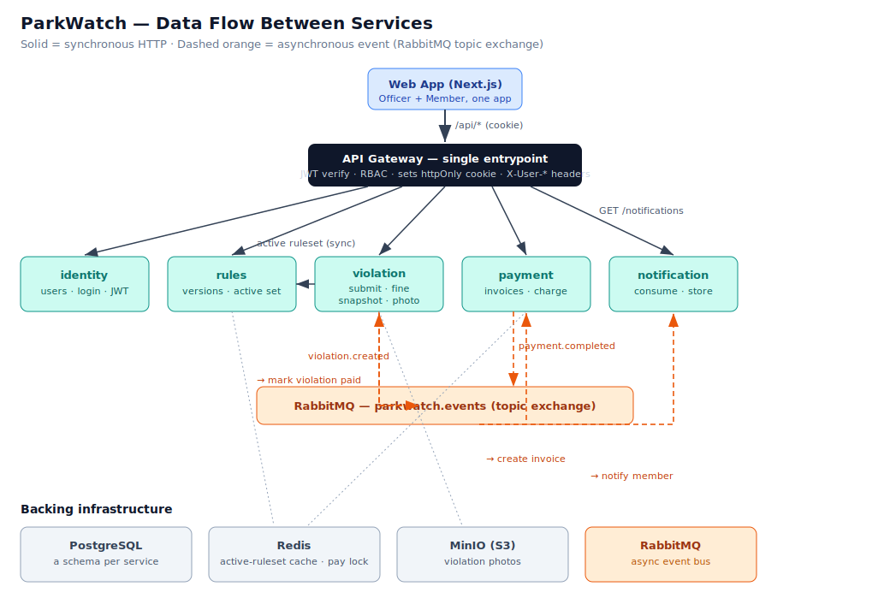
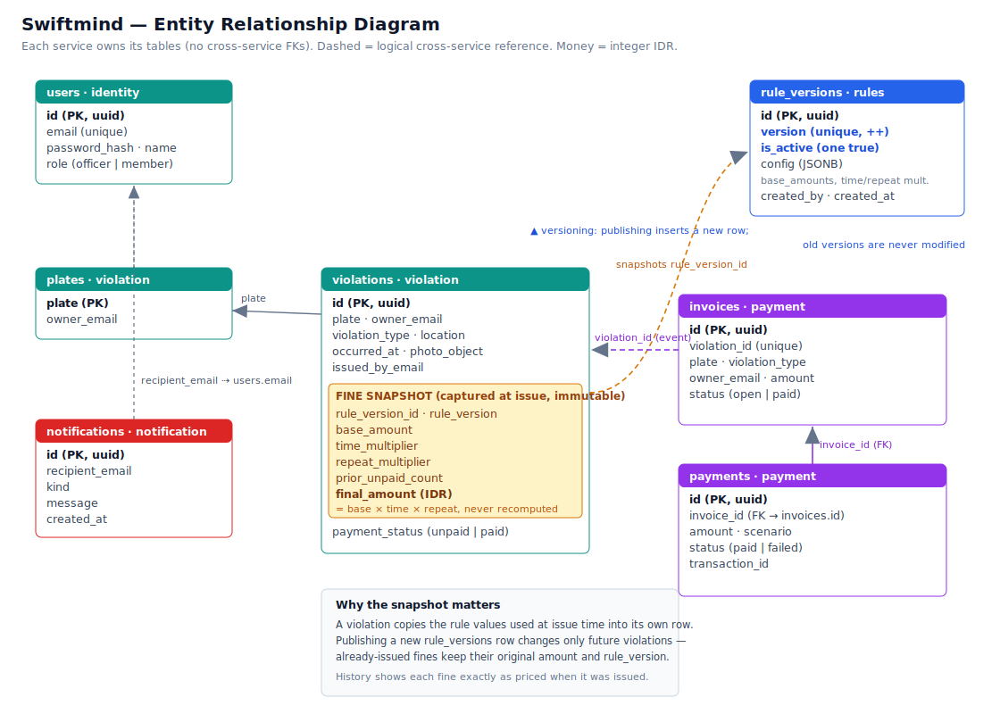

# ParkWatch — Design Document

A Parking Violation Portal where **Officers** issue violations and **Members** pay the resulting
fines. Fine rules are versioned, and every violation stores an immutable snapshot of how its fine
was calculated, so changing the rules never alters fines that were already issued.

## 1. Architecture

The backend is a set of **Go microservices** in a single Go module (one binary per service under
`cmd/`). An **API Gateway is the only entrypoint** between the frontend and the backend: it
verifies the JWT, enforces role-based access control, and reverse-proxies to the owning service,
forwarding the authenticated identity as trusted `X-User-*` headers. The whole stack runs under
Docker Compose.

| Service        | Responsibility                                                      | Owns (Postgres)        |
|----------------|---------------------------------------------------------------------|------------------------|
| `gateway`      | Single entrypoint — JWT verify, RBAC, routing                       | —                      |
| `identity`     | Users, login, JWT issuance                                          | `users`                |
| `rules`        | Fine-rule versioning, active ruleset                                | `rule_versions`        |
| `violation`    | Submit violation, compute fine, store snapshot, photo upload        | `plates`, `violations` |
| `payment`      | Invoices, mocked charge, payment records                            | `invoices`, `payments` |
| `notification` | Consume events, store per-user notifications                        | `notifications`        |

Each service owns its tables; there are no cross-service database joins. Where one service needs
another service's data it either calls it synchronously (violation → rules) or reacts to an event
(payment ← violation). Cross-service references are by stable keys (e.g. the member's email),
denormalized at write time.

## 2. Data flow

*Editable sources: [`docs/data-flow.drawio`](docs/data-flow.drawio) (draw.io) ·
[`docs/data-flow.puml`](docs/data-flow.puml) (PlantUML).*

**Synchronous (HTTP, request/response):**
- Browser → Gateway for everything (`/api/*`), cookie-authenticated.
- `violation → rules`: on submit, the violation service fetches the **active ruleset** to price the
  fine.
- `member → payment`: paying an invoice is a direct call that returns the charge result.

**Asynchronous (RabbitMQ topic exchange `parkwatch.events`):**
- `violation.created` → **payment** creates an invoice; **notification** notifies the member.
- `payment.completed` → **violation** marks the violation paid (so it stops counting as a prior
  unpaid); **notification** notifies the member and the officer who issued the violation.

Each event carries the data its consumers need (e.g. `violation.created` includes the issuing
officer's email so the invoice can keep it and `payment.completed` can notify that officer).
Notifications store the related `violation_id` so the UI can deep-link straight to the violation.

Async is used precisely where the work can happen out-of-band and shouldn't block the user: invoice
creation and notifications. The pricing read (active ruleset) is synchronous because the officer
must see the computed fine immediately.

### The five flows, end to end
1. **Officer submits a violation** → `POST /api/violations` (multipart with photo). The violation
   service uploads the photo to MinIO, fetches the active ruleset, counts prior unpaid violations
   for the plate, computes the fine, and stores the snapshot.
2. **Fine calculation** → `fine = base_amount(type) × time_multiplier × repeat_multiplier`,
   evaluated by a pure, unit-tested package (`pkg/fine`).
3. **Officer updates rules** → `POST /api/rules` inserts a **new** `rule_versions` row and flips
   it active. Past rows are untouched, so issued fines are unaffected.
4. **Member pays** → `POST /api/invoices/{id}/pay` with a `success`/`failed` scenario; the mocked
   provider returns `{status, transaction_id}`. On success the invoice is marked paid and
   `payment.completed` is published.
5. **Transaction history** → the violations view shows each violation, its fine, **and the rule
   version applied at issue time** (read straight from the snapshot).

## 3. Entity relationship diagram

*Editable sources: [`docs/erd.drawio`](docs/erd.drawio) (draw.io) ·
[`docs/erd.dbml`](docs/erd.dbml) (dbdiagram.io).*

**Rule versioning** is modelled as append-only rows in `rule_versions` (monotonic `version`, a
single `is_active` row enforced by a partial unique index). Publishing never updates an existing
row.

**The calculation snapshot** lives on each `violations` row: `rule_version_id`, `rule_version`,
`base_amount`, `time_multiplier`, `repeat_multiplier`, `prior_unpaid_count`, and `final_amount`.
These are written once, at issue time, and never recomputed — this is what makes a later rule change
unable to alter a past fine. `invoices` and `payments` carry the money forward unchanged.

## 4. Infrastructure (and why each is here)

| Component    | Used for                                                        | Justification                                              |
|--------------|-----------------------------------------------------------------|------------------------------------------------------------|
| PostgreSQL   | All relational data (money, versioning, snapshots)              | Needs ACID and relational integrity                        |
| RabbitMQ     | `violation.created`, `payment.completed`                        | Decouples invoicing and notifications from the request path |
| Redis        | Active-ruleset cache; payment idempotency lock                  | Ruleset is read on every submit; lock prevents double charge |
| MinIO (S3)   | Violation photos                                                | Binary blobs belong in object storage, not the database    |

## 5. Key decisions & trade-offs

- **Money** is stored as integer IDR; multipliers are applied and the result is rounded half-up.
  No floats for money.
- **Auth**: the gateway sets an httpOnly `access_token` cookie and forwards identity downstream as
  trusted headers. Downstream services are only reachable via the gateway on the internal network.
- **Plate ownership**: a `plates` registry maps a plate to a member's email; ownership is
  denormalized onto each violation so members see/pay only their own fines without a cross-service
  join. (Demo seed: `B1234ABC` → `member@parkwatch.test`.)
- **Schema management**: each service bootstraps its own tables on startup
  (`CREATE TABLE IF NOT EXISTS`) and seeds idempotently. **In production this would be replaced
  with versioned migrations** — chosen here to keep the reviewer's "one command to run it" simple.
- **Timestamps** for a violation are treated as UTC wall-clock end to end (entry, pricing, display)
  so the displayed time always matches the time multiplier that was applied.

## 6. What I'd do with more time

- Real authn hardening (refresh tokens, rotating secrets), and per-service auth on the internal
  network instead of trusting gateway headers.
- Versioned DB migrations; outbox pattern for events (instead of best-effort publish).
- Idempotent event consumers keyed by event id; dead-letter queues.
- More tests: violation/payment service integration tests, and a contract test for the event shapes.
- Read-only history endpoint that joins violation + payment + applied-rule details server-side.
